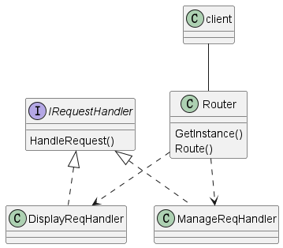

# course_management
## Local setup

### on Windows

1. Download, install, and setup environment for MySQL
2. Execute all the command in course_database_setup.sql on the SQL server
3. Configure database connection information in php-server/Database/config.php
4. Download and install XAMPP from https://www.apachefriends.org/
5. Copy folder "php-server" to /XAMPP/htdocs
6. Start Apache on XAMPP

### on Linux

To be updated...


## Module design



When receiving a request message, Router will generate the corresponding RequestHandler based on the path of the request message, and then call the handler's HandleRequest method to process the business.

DisplayReqHandler provides services for querying Enrolments records by user ID, course ID, or querying all records.

ManageReqHandler provides CRUD services for users, courses and enrolments.

## Apis

### GET /php-server/management?searchKey=user_id&searchValue=1&table=users
Response

```json
[
    {
        "user_id": 1,
        "first_name": "John",
        "surname": "Doe"
    }
]
```

```json
{
    "error": "Record not found"
}
```


### POST /php-server/management?table=users
Request

```json
{
    "first_name": "firstName",
    "surname": "surname"
}
```


Response

```json
{
    "message": "Data inserted successfully"
}
```


### PUT /php-server/management?searchKey=user_id&searchValue=1&table=users
Request

```json
{
    "first_name": "firstName",
    "surname": "surname"
}
```


Response

```json
{
    "message": "Data updated successfully"
}
```

```json
{
    "error": "No matching records found"
}
```


### DELETE /php-server/management?searchKey=user_id&searchValue=1&table=users
Response

```json
{
    "message": "Record deleted successfully"
}
```

```json
{
    "message": "No record found with given ID"
}
```


### GET /php-server/display?query_condition=by_user&id=1

Response

```json
[
    {
        "enrolment_id": "88",
        "first_name": "firstName",
        "surname": "surname",
        "description": "Psychology",
        "status": "completed"
    }
]
```

### GET /php-server/display?query_condition=by_course&id=1

Response

```json
[
    {
        "enrolment_id": "46",
        "first_name": "Karen",
        "surname": "Carter",
        "description": "Introduction to Computer Science",
        "status": "in progress"
    },
    {
        "enrolment_id": "51",
        "first_name": "Bob",
        "surname": "Brown",
        "description": "Introduction to Computer Science",
        "status": "in progress"
    }
]
```


### GET /php-server/display?query_condition=all

Response

```json
[
    {	...
     	(All the data)
    },
    {
        "enrolment_id": "100",
        "first_name": "Susan",
        "surname": "Adams",
        "description": "Biology Fundamentals",
        "status": "in progress"
    }
]
```

